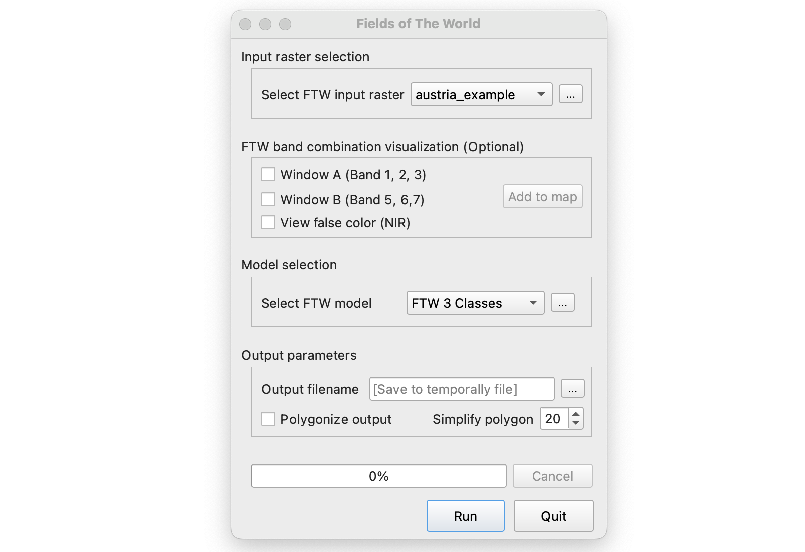

# Fields of The World (FTW) QGIS Plugin

**Version:** 0.1  
**Author:** Fields of The World Team  
**QGIS Minimum Version:** 3.0

---

### Description

**Fields of The World** is a QGIS plugin that allows users to harness the power of [FTW AI/ML models](https://fieldsofthe.world) to generate precise **field boundaries**. This tool simplifies the process of selecting an area of interest, running inference to generate raster outputs, and converting them into polygonized vector data in various formats.

---

### Features

- Select FTW model ready raste.
- Run model inference to predict field boundaries.
- Convert raster predictions into polygons.
- Export results 

---
### UI Layout

### Installation

TBA
---

### Status

⚠️ **This plugin is currently experimental.** Feedback and contributions are welcome!

---

### Bug Reports & Contributions

- Report issues: [Issue Tracker](http://github.com/fieldsoftheworld/ftw-qgis-plugin/issues)
- Source code: [GitHub Repository](http://github.com/fieldsoftheworld/ftw-qgis-plugin)

---

### 📄 License

This project is licensed under the terms described in the repository. See the [LICENSE](http://github.com/fieldsoftheworld/ftw-qgis-plugin/blob/main/LICENSE) file for more information.

